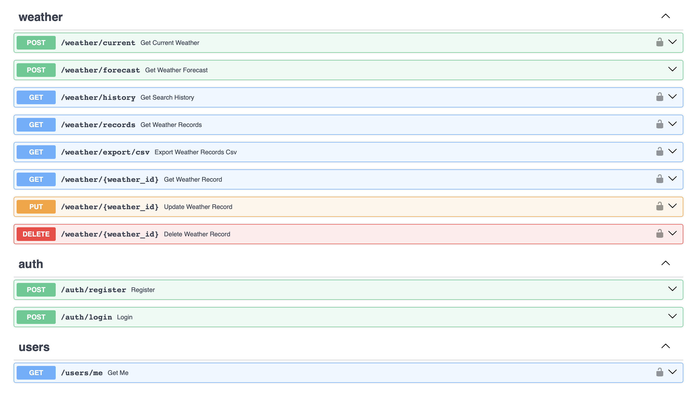
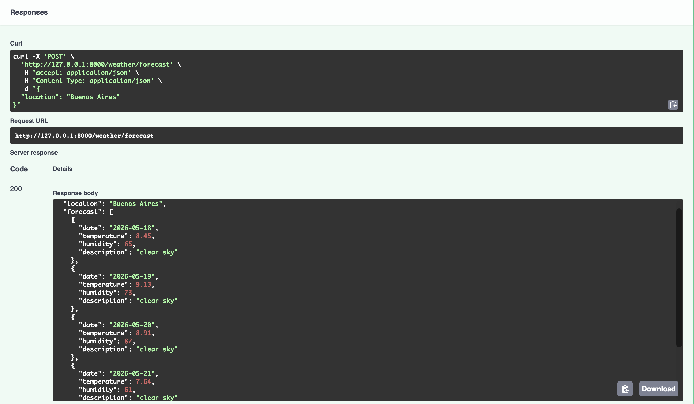
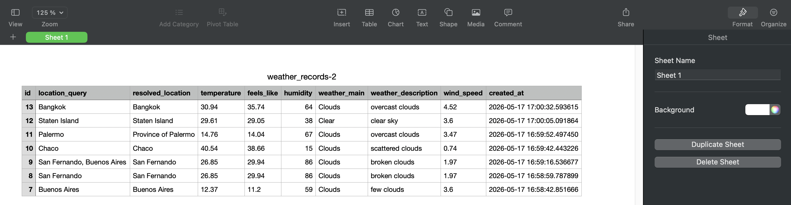
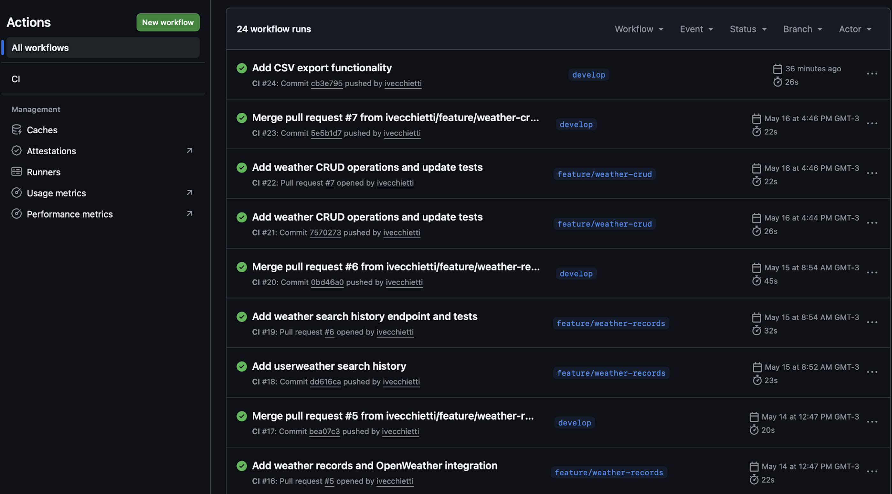

# weather-app


Modern full-stack weather application built with FastAPI and Next.js.

This project was developed as part of the PM Accelerator AI Engineer Internship Technical Assessment.

---

## Overview

The application allows users to:

- Register and authenticate securely using JWT
- Retrieve real-time weather information
- Retrieve 5-day weather forecasts
- Store weather searches in a PostgreSQL database
- Perform full CRUD operations on weather records
- Export weather records as CSV files
- Interact with a REST API documented with Swagger/OpenAPI
- Run the entire stack using Docker Compose

The project follows professional backend engineering practices including modular architecture, database migrations, automated testing, CI/CD pipelines, and environment-based configuration.

---

## Features

### Backend

- FastAPI REST API
- JWT authentication
- Password hashing
- PostgreSQL integration
- SQLAlchemy ORM
- Alembic database migrations
- Dependency injection pattern
- Environment-based configuration with `pydantic-settings`
- Automated testing with `pytest`
- Code quality checks with `ruff`
- Current weather endpoint
- 5-day weather forecast endpoint
- Search history persistence
- CSV export functionality
- Swagger/OpenAPI documentation
- Health check endpoint


### DevOps

- Docker Compose setup
- GitHub Actions CI pipeline
- Automated linting and testing
- Architecture Decision Records (ADRs)

---

## Tech Stack

### Backend

- Python 3.11+
- FastAPI
- SQLAlchemy
- Alembic
- PostgreSQL
- Pydantic
- JWT Authentication
- Pytest
- Ruff


### DevOps

- Docker
- Docker Compose
- GitHub Actions

### External APIs

- OpenWeather API

---

## API Endpoints

### Authentication

| Method | Endpoint | Description |
|---|---|---|
| POST | `/auth/register` | Register a new user |
| POST | `/auth/login` | Login and receive JWT token |

### Users

| Method | Endpoint | Description |
|---|---|---|
| GET | `/users/me` | Retrieve authenticated user information |

### Weather

| Method | Endpoint | Description |
|---|---|---|
| POST | `/weather/current` | Retrieve current weather |
| POST | `/weather/forecast` | Retrieve 5-day weather forecast |
| GET | `/weather/history` | Retrieve recent search history |
| GET | `/weather/records` | Retrieve stored weather records |
| GET | `/weather/{weather_id}` | Retrieve a specific weather record |
| PUT | `/weather/{weather_id}` | Update a weather record |
| DELETE | `/weather/{weather_id}` | Delete a weather record |
| GET | `/weather/export/csv` | Export weather records as CSV |

---

## Project Structure

```text
.
├── alembic/               # Database migrations
├── app/
│   ├── api/               # API routes and dependencies
│   ├── core/              # Configuration and security
│   ├── db/                # Database setup
│   ├── exceptions/        # Handlers
│   ├── models/            # SQLAlchemy ORM models
│   ├── schemas/           # Pydantic schemas
│   ├── services/          # External API services
│   └── main.py            # FastAPI application
├── docs/
│   └── adr/               # Architecture Decision Records
├── tests/                 # Automated tests
├── screenshots/           # README screenshots
├── .github/
│   └── workflows/         # GitHub Actions CI
├── Dockerfile
├── docker-compose.yml
├── requirements.txt
└── README.md
```

---

## Environment Variables

Create a `.env` file in the project root:

```env
WEATHER_API_KEY=your_openweather_api_key
DATABASE_URL=postgresql://weather_user:weather_password@db:5432/weather_db
API_KEY=your_api_key
SECRET_KEY=your_secret_key
ALGORITHM=HS256
ACCESS_TOKEN_EXPIRE_MINUTES=60
```

---

## Run with Docker

### Build and start containers

```bash
docker compose up --build
```

### Run database migrations

```bash
docker compose exec api alembic upgrade head
```

### Stop containers

```bash
docker compose down
```

---

## Local Development

### Install dependencies

```bash
pip install -r requirements.txt
```

### Start backend server

```bash
uvicorn app.main:app --reload
```

---

## Application URLs

### Backend API

```text
http://localhost:8000
```

### Swagger Documentation

```text
http://localhost:8000/docs
```

### Health Check

```text
http://localhost:8000/health
```

---

## Testing

Run tests:

```bash
pytest
```

Run linting:

```bash
ruff check .
```

---

## Continuous Integration

The project includes a GitHub Actions CI pipeline that automatically:

- Runs Ruff lint checks
- Executes automated tests
- Validates pull requests
- Verifies environment configuration

The pipeline runs on:

- pushes to `develop`
- pushes to `feature/**`
- pull requests to `main` and `develop`

---

## Architecture Decisions

Technical decisions are documented using ADRs inside:

```text
docs/adr/
```

Current ADRs include:

- FastAPI framework selection
- Pydantic settings configuration
- PostgreSQL database choice
- SQLAlchemy + Alembic strategy

---

## Screenshots

### Swagger Documentation



### 5-Day Forecast Endpoint



### CSV Export Functionality



### GitHub Actions CI Pipeline



---

## Future Improvements

- Redis caching
- Rate limiting
- Background tasks
- Weather analytics
- Frontend dashboard improvements
- User preferences
- Deployment infrastructure
- Monitoring and observability

---

---

## PM Accelerator

Product Manager Accelerator (PMA) is a professional training and career development organization focused on helping Product Management professionals grow throughout every stage of their careers.

Their programs support students, aspiring Product Managers, and experienced product leaders through mentorship, AI Product Management education, interview preparation, leadership training, and hands-on project experience.

PM Accelerator provides services such as:

- PMA Pro
- AI PM Bootcamp
- PMA Power Skills
- PMA Leader
- 1:1 Resume Review
- Free Product Management training resources

The organization focuses on building strong product management, leadership, and AI-driven problem-solving skills through practical learning experiences and real-world applications.

Official Website:
https://www.pmaccelerator.io/

LinkedIn:
https://www.linkedin.com/company/product-manager-accelerator/

---

## About

Developed by **Ivo Vecchietti** as part of the PM Accelerator AI Engineer Internship Technical Assessment.

This project demonstrates backend engineering concepts including:

- REST API development
- Authentication and authorization
- Database persistence
- CRUD operations
- External API integration
- CI/CD pipelines
- Docker-based environments
- Automated testing
- Software architecture best practices